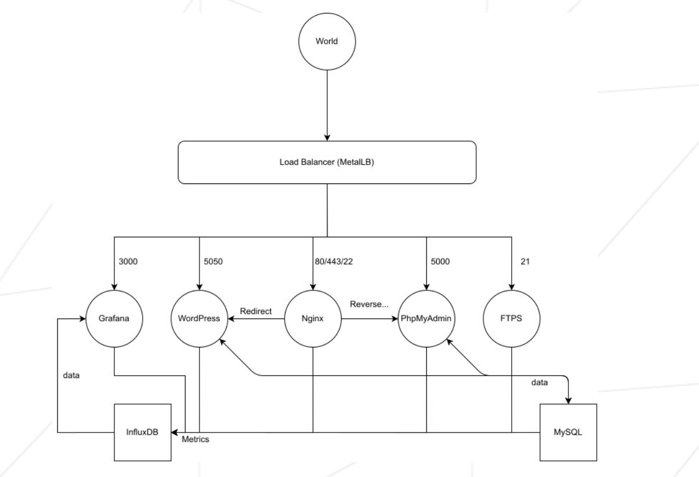

# services

This project consist to clusturing an docker-compose application and deploy it with Kubernetes.

## Describe

The project consists of setting up an infrastructure of different services using Kubernetes.

Each service run in a dedicated container.

Each container bear the same name as the service concerned and for performance reasons, containers build using Alpine Linux.

Also, they have a Dockerfile written by myself which is called in the setup.sh.

**To run project** you need to run setup.sh (but before you need to install kubernetes, docker and virtualbox).

## What implement in project:

• The Kubernetes web dashboard. This will help you manage your cluster.

• The Load Balancer which manages the external access of services. It the only entry point to cluster. Load Balancer have a single ip.

• A WordPress website listening on port 5050, which work with a MySQL database. Both services run in separate containers. The WordPress website have several users and an administrator. Wordpress use own nginx server. The Load Balancer redirect directly to this service.

• phpMyAdmin, listening on port 5000 and linked with the MySQL database. PhpMyAdmin use own nginx server. The Load Balancer redirect directly to this service.

• A container with an nginx server listening on ports 80 and 443. Port 80 in http and have a systematic redirection of type 301 to 443 in https. This container allow access to a /wordpress route that makes a redirect 307 to IP:WPPORT. It also allow access to /phpmyadmin with a reverse proxy to IP:PMAPORT.

• A FTPS server listening on port 21.

• A Grafana platform, listening on port 3000, linked with an InfluxDB database. Grafana monitoring all containers, with one dashboard per service. InfluxDB and grafana in two distincts containers.

• In case of a crash or stop of one of the two database containers, data will persist.

• All containers restart in case of a crash or stop of one of its component parts.

Project outline

